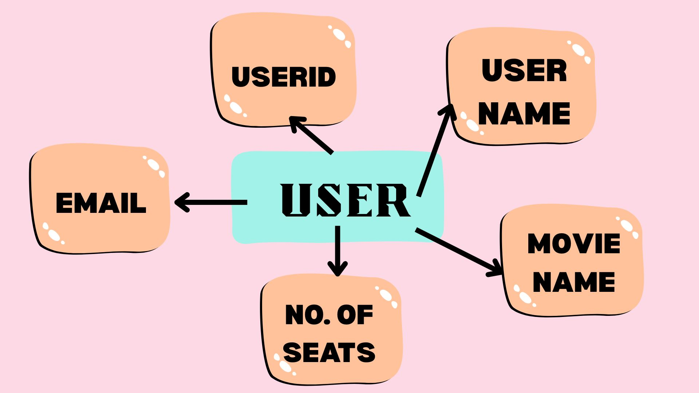

# Ex02 Django ORM Web Application
## Date: 6.04.2025

## AIM
To develop a Django application to store and retrieve data from a Movies Database using Object Relational Mapping(ORM).

## ENTITY RELATIONSHIP DIAGRAM



## DESIGN STEPS

### STEP 1:
Clone the problem from GitHub

### STEP 2:
Create a new app in Django project

### STEP 3:
Enter the code for admin.py and models.py

### STEP 4:
Execute Django admin and create details for 10 books

## PROGRAM
```
admin.py

from django.contrib import admin
from .models import Movies,MoviesAdmin
admin.site.register(Movies,MoviesAdmin)

models.py

from django.db import models
from django.contrib import admin
class Movies (models.Model):
    USERID=models.CharField(max_length=20,help_text="USER_ID")
    USERNAME=models.CharField(max_length=100)
    MOVIENAME=models.CharField(max_length=100)
    NOOFSEATS=models.IntegerField()
    EMAIL=models.EmailField()

class MoviesAdmin(admin.ModelAdmin):
    list_display=('USERID','USERNAME','MOVIENAME','NOOFSEATS','EMAIL')

```

## OUTPUT


## RESULT
Thus the program for creating movies database using ORM hass been executed successfully
